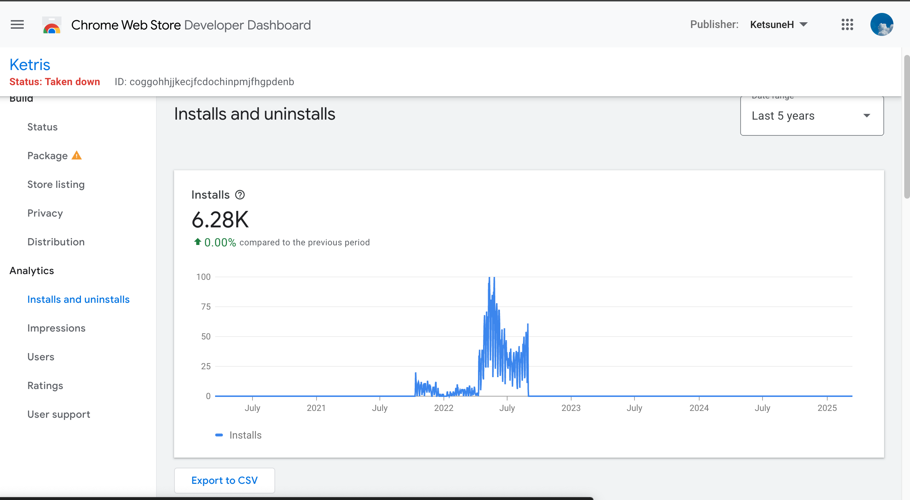

# Ke Hu

(NZ citizen / Native in English and Mandarin / conversational in Japanese)

Phone: 021 063 0255  
E-mail: kehubp@gmail.com 

## Education: 

University of Auckland, school of Computer Science, undergraduate (2024 – present); 
Macleans College(High school), Cambridge International AS & A Levels 

## Highlights: 

A+ grade certificate in **Python Programming** course in university  
A+ grade certificate in **Computer Systems** course in university  

Proficient in **Python**, familiar with **Git**  
Familiar with **JavaScript** and **HTML/CSS**, done a little bit of **Cucumber** language and **BDD**  
Familiar with **Java** and **Object-Oriented programming**  

**Class representative** of Japanese language Stage 2 course at UoA

Year 13 Cultural Captain position at Macleans College  

A+ grade in Japanese Language course in university 

Willing to learn with diligence 

## Personal project: 

Fully functional Tetris game (https://github.com/KeFx/Ketris) chrome extension using Javascript and HTML/CSS (Published on chrome web store but was removed due to copyright), developed in a formal agile-style with proper git commit records.

